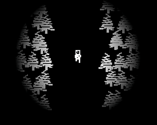

# Lost
A short "horror" game made in 2 days for CGDC Game Jam. Mostly a learning experience for the Bevy game engine. Visuals were made in Aesprite and Audio was made using Vital and Audacity.

## Usage
Build using `cargo build --release`.
